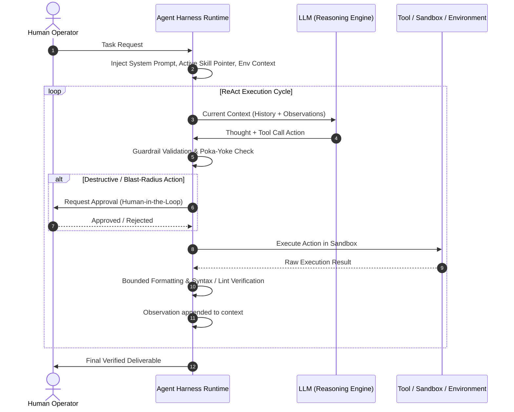
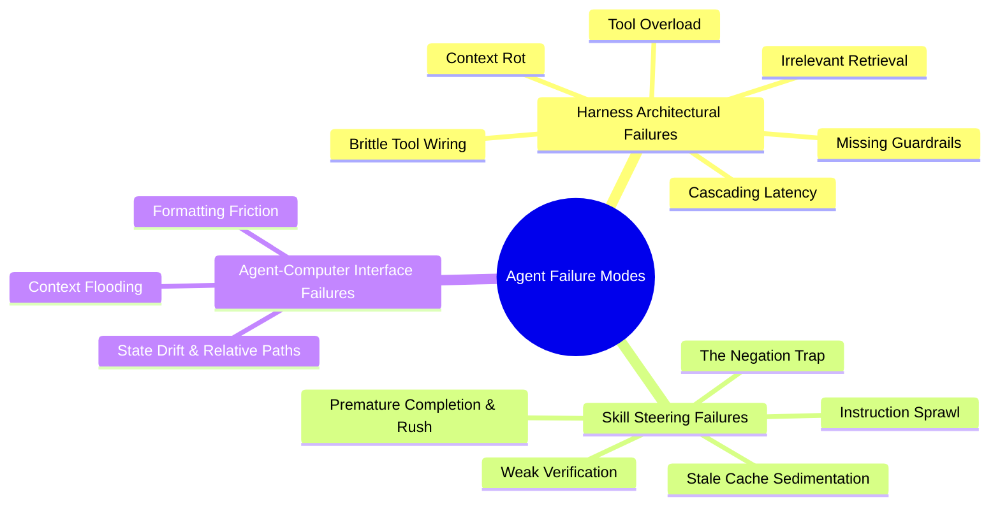
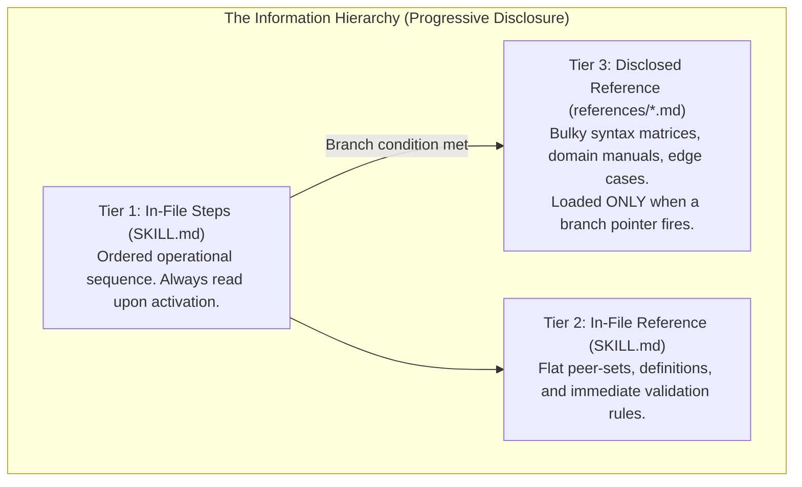
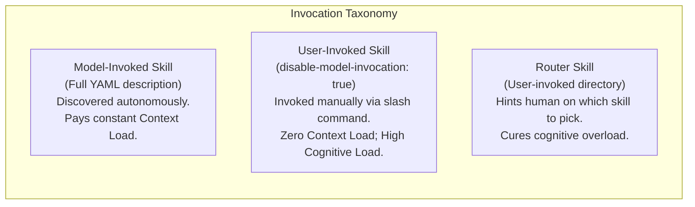
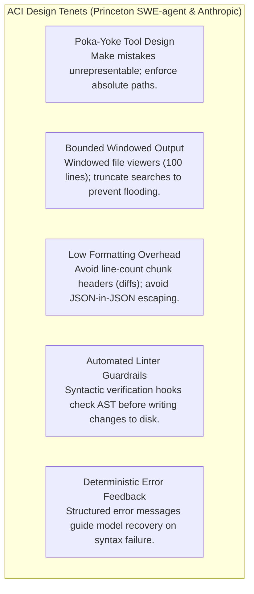
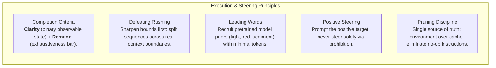

# Engineering Production AI Agent Skills and Harnesses: Architectural Best Practices, Failure Modes, and Design Patterns

---

## 1. Executive Summary

Building reliable, production-grade AI agents requires shifting focus from prompt engineering to **harness engineering** and **agent-computer interface (ACI) design**. While large language models (LLMs) provide reasoning, planning, and language comprehension ("the brain"), raw models cannot autonomously solve complex software engineering or enterprise tasks without degradation. The surrounding runtime infrastructure—the **agent harness** ("the body and workspace")—and the modular domain instructions executed within it—the **agent skills**—govern whether an agent succeeds or collapses into failure modes such as context rot, premature completion, or destructive execution.

Empirical research across the AI industry reveals decisive findings:
- **Interface Design Matters as Much as Raw Model Scale**: In the Princeton SWE-agent study (Yang et al., NeurIPS 2024), equipping language models with an Agent-Computer Interface (ACI) designed specifically for LLM cognitive profiles outperformed a standard bash-only shell baseline by **10.7 percentage points** on SWE-bench Lite (18.0% vs. 7.3%), with specialized editing and linting guardrails accounting for the majority of the gain.
- **Harness Infrastructure Governs Enterprise Reliability**: As demonstrated by Databricks (2025/2026), pairing a model with a tailored task harness (e.g., OfficeQA Pro Harness) increased benchmark accuracy from 36.10% to 52.63%, cutting errors nearly in half without retraining the underlying model.
- **Simplicity Outperforms Heavy Abstraction**: Anthropic’s engineering research (Schluntz & Zhang, 2024) demonstrates that production agent systems succeed through radical simplicity—composable workflows (prompt chaining, routing, parallelization, orchestrator-workers, evaluator-optimizers) and mistake-proofed ("poka-yoke") tools—rather than multi-layered agent frameworks that obscure prompts and responses.
- **Context Economy is an Architectural Budget**: In Google Antigravity and Claude Code agent architectures, instructions spend two distinct budgets: **Context Load** (tokens and attention permanently consumed in-context every turn) and **Cognitive Load** (the mental overhead required by the human operator). Preventing failure requires **progressive disclosure**, **vocabulary anchoring through leading words**, and **observable completion criteria**.

This reference manual synthesizes primary-source engineering literature and production runbooks into a unified framework for authoring, evaluating, and operating AI agent skills and harnesses.

```mermaid
flowchart TD
    subgraph AgentSystem["The Complete Agentic System (Agent = Model + Harness)"]
        subgraph ModelLayer["Reasoning Engine (Model / Brain)"]
            M[LLM: GPT-5.5 / Claude Sonnet 4.5 / Gemini 2.5]
        end
        subgraph HarnessLayer["Execution & Environment (Harness / Body & Workspace)"]
            H1[System Prompt & Identity]
            H2[Agent-Computer Interface & Tool Dispatch]
            H3[Isolated Sandboxes & Safe Runtime]
            H4[Durable Filesystem & Persistent Storage]
            H5[Context Compaction & Memory Pipelines]
            H6[Feedback Loops & Linters / Verifiers]
            H7[Guardrails & Human-in-the-Loop Gates]
            H8[Observability, Tracing & MLflow Evals]
        end
        subgraph SkillLayer["Modular Capability Packages (Skills / Runbooks)"]
            S1["SKILL.md (Core Procedure & Completion Gates)"]
            S2["Context Pointers & Trigger Wording"]
            S3["Disclosed References & Domain Cheatsheets"]
            S4["Executable Scripts & Custom ACI Tools"]
        end
    end
    M <--> HarnessLayer
    HarnessLayer --> SkillLayer
```



---

## 2. Primary Source Citations & References

Every finding and architectural pattern in this guide originates from primary engineering sources and research papers:

1. **Databricks Engineering Staff (2025/2026)**: *"What is an AI Agent Harness?"*, Databricks Data + AI Foundations.
   - *Key Contributions*: Formalized the equation $\text{Agent} = \text{Model} + \text{Harness}$; detailed the 8 core building blocks of production harnesses; established the shift from prompt engineering to context engineering to harness engineering; cataloged the 7 operational harness failure modes; defined disposable harnesses and Natural-Language Agent Harnesses (NLAHs).
2. **Erik Schluntz & Barry Zhang (Anthropic, 2024)**: *"Building Effective Agents"*, Anthropic Research & Engineering.
   - *Key Contributions*: Architectural dichotomy between deterministic *Workflows* vs. autonomous *Agents*; the 5 foundational workflows (Prompt Chaining, Routing, Parallelization [Sectioning & Voting], Orchestrator-Workers, Evaluator-Optimizer); Agent-Computer Interface (ACI) principles; poka-yoke (mistake-proofing) tool design; elimination of formatting friction (diff chunk headers vs. atomic edits, JSON-in-JSON escaping).
3. **John Yang, Carlos E. Jimenez, Alexander Wettig, Kilian Lieret, Shunyu Yao, Karthik Narasimhan, Ofir Press (Princeton University, NeurIPS 2024)**: *"SWE-agent: Agent-Computer Interfaces Enable Automated Software Engineering"*, arXiv:2405.15793.
   - *Key Contributions*: Established LLMs as a distinct category of end-users requiring dedicated ACIs; demonstrated why human-centric shell tools (`cat`, `sed`, `grep`) induce catastrophic failures; introduced bounded windowed file navigation (`open`, `scroll_up`, `scroll_down`), atomic line replacement (`edit`), and automated linter guardrails before disk commits; provided rigorous ablation studies proving ACI superiority over bash baselines.
4. **Shunyu Yao, Jeffrey Zhao, Dian Yu, Nan Du, Izhak Shafran, Karthik Narasimhan, Yuan Cao (Princeton University & Google Brain, ICLR 2023)**: *"ReAct: Synergizing Reasoning and Acting in Language Models"*, arXiv:2210.03629.
   - *Key Contributions*: Formulated the repeating **Reason $\to$ Act $\to$ Observe** loop that underpins modern agent execution.
5. **Google Antigravity & Agent Customization Architecture (2025/2026)**:
   - `writing-for-agents/SKILL.md` & `SKILL-MECHANICS.md`: Defined the *Two Loads* (Context Load vs. Cognitive Load), Information Hierarchy (In-file step $\to$ In-file reference $\to$ Disclosed reference), Context Pointers, Trigger Wording, Completion Criteria (Clarity vs. Demand), Leading Words, the Negation Trap, and Pruning Discipline (Single Source of Truth, Environment as Source of Truth, Sedimentation, No-Op instruction elimination).
   - `agy-customizations/SKILL.md` & docs: Progressive disclosure mechanics, multi-tier customization precedence (Workspace $\to$ Declared $\to$ Global $\to$ Builtin), and tool sandboxing.

---

## 3. Core Concepts: Model vs. Harness vs. Skill

To design, debug, and scale agent systems, engineers must establish clear vocabulary boundaries between the model, the harness, and the skill.

| Component | Definition | Primary Responsibility | Analogy |
| :--- | :--- | :--- | :--- |
| **Model** | Deep neural network (e.g., Claude 3.5/3.7/4.5, GPT-4o/5, Gemini 1.5/2.5) | Token prediction, reasoning, semantic comprehension, next-step selection. | The **Brain** |
| **Harness** | Software infrastructure wrapping the model | Tool execution, process isolation, context management, durable storage, guardrails, telemetry. | The **Body & Workspace** |
| **Skill** | Modular package of instructions, rules, and scripts | Procedural knowledge, step ordering, domain constraints, completion gates. | The **Job Runbook & Protocol** |
| **Agent** | The holistic running system | Autonomous task execution through the synergy of Model + Harness + Skills. | The **Worker** |

### 3.1 The Reason-Act-Observe Execution Loop
At the core of an agent harness is the **ReAct loop** (Yao et al., 2022; Databricks, 2025):
1. **Reason**: The model inspects everything currently in its context window (system prompt, active skills, user instructions, environment state, and preceding execution history) and formulates an actionable intent.
2. **Act**: The harness parses the model's generated tool call, validates its arguments against schemas, enforces permission boundaries, and executes the action (invoking an API, spawning a sandbox process, writing a file).
3. **Observe**: The harness captures the tool's raw execution output, truncates or structures it to prevent context flooding, and appends the observation back into the context window as ground truth.
4. **Repeat**: The model evaluates the observation against its goal and decides whether to continue, adjust course, or conclude.



### 3.2 The Eight Building Blocks of a Production Harness (Databricks)
According to Databricks (2025), a production-grade harness requires eight distinct structural components:
1. **System Prompt**: Standing set of invariant instructions specifying identity, behavioral guardrails, operational bounds, and baseline tool interaction formats.
2. **Tools**: Structured interfaces connecting the LLM to external systems (APIs, databases, bash environments, code execution engines). Modern harnesses increasingly provide general code execution capabilities rather than brittle collections of hundreds of micro-tools.
3. **Sandbox**: Isolated, ephemeral execution environments (Docker containers, microVMs, gVisor sandboxes) that prevent destructive operations from escaping to host machines and allow horizontal agent parallelization.
4. **Filesystem**: Durable external storage enabling agents to persist notes, architecture diagrams, state models, and intermediate deliverables across multi-step sessions without exhausting the context window.
5. **Memory & Context Management**: Dynamic context management infrastructure comprising in-session **context compaction** (summarizing older dialogue branches) and cross-session retrieval.
6. **Feedback Loops & Self-Verification**: Automated verification hooks (unit tests, linters, headless browsers, schema validators) that execute immediately following an agent action, feeding ground-truth errors back to the model.
7. **Guardrails & Human-in-the-Loop Controls**: Hard interception barriers that enforce policy rules, block unauthorized writes/deletions, and demand human approval for irreversible actions.
8. **Observability & Evaluation**: Structured telemetry, OpenTelemetry/MLflow tracing of token trajectories, step latencies, cost tracking, and systematic regression evaluation pipelines against ground-truth benchmarks.

### 3.3 Workflows vs. Autonomous Agents (Anthropic)
Anthropic's engineering guidance (Schluntz & Zhang, 2024) establishes a critical design dividing line:
- **Workflows**: Systems where LLMs and tools are orchestrated through **predefined programmatic code paths**. Workflows maximize predictability, minimize latency, and are ideal for structured tasks with known subtasks.
  - *Prompt Chaining*: Linear sequence of calls with intermediate validation gates.
  - *Routing*: Input classification directing requests to specialized prompts, tools, or smaller cost-effective models.
  - *Parallelization*: *Sectioning* (concurrently executing independent subtasks) and *Voting* (redundant evaluations aggregated programmatically).
  - *Orchestrator-Workers*: Central LLM dynamically decomposes a problem, delegates subtasks to parallel worker agents, and synthesizes results.
  - *Evaluator-Optimizer*: A generator LLM drafts an output while an evaluator LLM provides targeted critique in an iterative refinement loop.
- **Autonomous Agents**: Systems where the LLM dynamically dictates its own trajectory, tools, and iteration count in open-ended ReAct loops. Autonomous agents are essential when step counts cannot be predetermined, but they trade off increased token consumption, higher latency, and risks of error compounding.

### 3.4 The Shift to Harness Engineering
The discipline of programming language models has progressed through three distinct eras:
1. **Prompt Engineering (2022–2023)**: Crafting phrasing, few-shot examples, and chain-of-thought system prompts for isolated single-turn LLM completions.
2. **Context Engineering (2023–2024)**: Engineering RAG pipelines, chunking algorithms, and semantic retrieval to select the most relevant tokens for the model's fixed window.
3. **Harness Engineering (2024–Present)**: Engineering the complete runtime, execution environment, ACI tool protocols, deterministic validation loops, sandboxes, and progressive disclosure systems that empower models to operate as reliable agents.

---

## 4. Comprehensive Taxonomy of Failure Modes

Production agents fail far more frequently from flawed harness and skill architectures than from raw model cognitive deficiencies. Below is the systematic taxonomy of failure modes synthesized across Databricks, Anthropic, SWE-agent, and Google Antigravity research.



### 4.1 Harness Architectural Failure Modes (Databricks)

#### 1. Context Rot
- **Root Cause**: Unbounded accumulation of raw tool outputs, verbose terminal logs, multi-turn reasoning traces, and dead-end code attempts inside the active context window. Attention distribution dilutes over long token sequences ("lost in the middle").
- **Production Manifestation**: The agent begins hallucinating file contents, forgets early user constraints, repeats previously failed tool calls, or degrades in reasoning quality after turn 10–15.
- **Architectural Mitigation**: 
  - Implement active **context compaction** (summarizing older conversation rounds into compact milestones).
  - Externalize intermediate working memory to durable scratchpad files on the filesystem instead of conversational context.
  - Isolate large investigations into ephemeral subagents whose token context is discarded upon returning a synthesized report.

#### 2. Tool Overload
- **Root Cause**: Injecting dozens of tool JSON schemas simultaneously into the model's system prompt or tool namespace.
- **Production Manifestation**: Selection confusion, misrouted function calls, increased latency before the first step, and higher tool invocation error rates.
- **Architectural Mitigation**:
  - Restrict the always-active toolset to a minimal core (read, write, bash/python execution).
  - Use progressive tool routing: dynamically expose specialized tools or skills only when their domain branch is activated.
  - Consolidate narrow micro-tools into general-purpose code execution environments.

#### 3. Brittle Tool Wiring
- **Root Cause**: Complex, subtle, or ambiguous tool parameters where small schema changes or unclear docstrings cause the model to supply invalid types, missing parameters, or improper formatting.
- **Production Manifestation**: Silent tool execution failures, fallback loops where the agent repeatedly retries the same broken argument, or unhandled exceptions crashing the harness loop.
- **Architectural Mitigation**:
  - Apply **poka-yoke** design (Anthropic): simplify parameter signatures to make invalid invocations unrepresentable.
  - Return informative, structured error messages instructing the model on the exact parameter format expected rather than raising opaque stack traces.

#### 4. Cascading Latency
- **Root Cause**: Monolithic sequential execution where an agent performs 20+ sequential tool calls, each requiring an LLM inference roundtrip taking 5–15 seconds.
- **Production Manifestation**: End-to-end task durations stretching to 5–15 minutes, leading to dropped connection timeouts and unacceptable user experience.
- **Architectural Mitigation**:
  - Decompose workflows using Anthropic's **Parallelization** pattern (sectioning independent file inspections across parallel subagents).
  - Delegate fast, deterministic multi-step operations to compiled helper scripts in `scripts/` rather than driving each command via model turn-taking.

#### 5. Irrelevant Retrieval & Context Poisoning
- **Root Cause**: Vector databases or RAG pipelines naively injecting large chunks of loosely matching documentation, tests, or obsolete code into the prompt.
- **Production Manifestation**: The agent anchors on irrelevant examples, mimics deprecated APIs, and generates confident but non-functional solutions.
- **Architectural Mitigation**:
  - Employ contextual chunking and strict reranking algorithms.
  - Prefer agent-directed discovery (allowing the agent to search and read targeted lines via ACI tools) over passive bulk RAG injection.

#### 6. Missing Guardrails & Blast-Radius Expansion
- **Root Cause**: Giving the agent unrestricted system privileges (e.g., raw bash execution as root, unrestricted database write access, automatic git push to main) without deterministic permission checks.
- **Production Manifestation**: Accidental `rm -rf`, dropping tables, leaking credentials into git commits, or deploying unreviewed code to production.
- **Architectural Mitigation**:
  - Enforce isolated sandboxes (Docker/microVMs) with read-only mounts for critical resources.
  - Programmatic permission gates: intercept irreversible destructive commands and mandate explicit human authorization before execution.

---

### 4.2 Skill Design & Execution Failure Modes (Writing-for-Agents & SWE-agent)

#### 7. Weak Verification & False Termination
- **Root Cause**: The skill or harness relies on the model's internal confidence rather than external, deterministic verification to conclude a task.
- **Production Manifestation**: The agent announces that tests pass or bugs are resolved without having executed the test suite, or declares success despite failing terminal assertions.
- **Architectural Mitigation**:
  - Mandate programmatic feedback loops: harness refuses termination until a verification command (e.g., `pytest`, `npm test`) exits with returncode 0.
  - Require the agent to observe and cite specific test log output before generating completion messages.

#### 8. Premature Completion & The Post-Completion Rush
- **Root Cause**: Fuzzily worded completion criteria ("ensure code is clean and understood") combined with visible upcoming steps in the instruction file. The visible steps ahead (**post-completion steps**) exert cognitive pull; the agent rushes through the current step's investigative legwork to reach "done".
- **Production Manifestation**: Superficial root-cause diagnosis, skimming only the first 5 lines of a bug report, or editing code before locating all dependent call sites.
- **Architectural Mitigation**:
  - **Sharpen completion bounds** into binary, checkable criteria ("every modified model accounted for", "reproduction script fails before edit and passes after edit").
  - **Split sequences across real context boundaries**: dispatch deep investigation to a subagent so the final implementation steps are physically absent from its context window.

#### 9. The Negation Trap
- **Root Cause**: Steering the model through prohibition statements ("Do NOT use `var`", "Do NOT hallucinate", "Don't think of an elephant"). Prohibitions drag the forbidden concept into the model's active attention window; because negation is a weak grammatical modifier, the strongly activated concept is inadvertently reinforced.
- **Production Manifestation**: The agent frequently commits the exact forbidden error it was explicitly instructed to avoid.
- **Architectural Mitigation**:
  - **Prompt the positive target behavior**: instruct the agent on what to do rather than what to avoid ("Declare variables using `const` or `let`").
  - Prohibitions earn a place only as hard mechanical guardrails (linters or AST checkers in the harness) that reject the action deterministically.

#### 10. Context Flooding from Human CLI Tools (SWE-agent)
- **Root Cause**: Providing language models with standard human Unix utilities (`cat`, `find /`, `grep -r`, `git log`).
- **Production Manifestation**: A single `cat large_file.py` or `grep` on a common string returns 50,000 lines of text, completely blowing the context window, causing immediate context rot, and incurring massive token costs.
- **Architectural Mitigation**:
  - Implement ACI windowed tools (SWE-agent `open` command restricted to 100 lines with pagination).
  - Search tools must truncate results and instruct the agent: *"Found 412 matches. Please refine your query."*

#### 11. Stale Cache Sedimentation
- **Root Cause**: Documenting facts in skill files that already exist in the project environment (`package.json` scripts, directory trees, CLI `--help` flags).
- **Production Manifestation**: As the codebase evolves, the skill instructions drift out of sync. The agent attempts to run deprecated commands or invalid script names. Over time, fear of deleting rules creates **sediment**: layers of stale instructions that waste context and dilute attention.
- **Architectural Mitigation**:
  - Treat the **environment as the single source of truth**. Delete static lists of commands; instruct the agent to run `npm run` or read `package.json` directly.
  - Cache in skills only what the agent cannot discover through inspection: unwritten project conventions, domain gotchas, and non-obvious rationales.

#### 12. Attention Sprawl
- **Root Cause**: Writing monolithic instruction files (500+ lines) attempting to cover every operational edge case in one place.
- **Production Manifestation**: Attention thins across excess text. Adherence to critical core rules becomes a statistical coin-flip.
- **Architectural Mitigation**:
  - Enforce the **Information Hierarchy**: keep `SKILL.md` strictly to ordered steps and essential operational bounds.
  - Move bulky reference tables and edge cases to disclosed files (`references/*.md`) linked via context pointers.

#### 13. State Drift & Relative Path Fragility
- **Root Cause**: Tools allowing relative file paths combined with shell commands that alter the working directory (`cd`).
- **Production Manifestation**: An agent changes directory in step 3, subsequent tool calls assume the repository root, and file edits target wrong directories or fail with `FileNotFound`.
- **Architectural Mitigation**:
  - Enforce **poka-yoke absolute paths** (Anthropic SWE-bench finding): require all file tools to mandate absolute paths or resolve strictly against a fixed workspace root.

---

## 5. Architectural Best Practices for Skill Design

Skills are modular capability extensions designed to teach an agent how to execute specific multi-step workflows. Designing robust skills requires managing context economics, structuring information hierarchically, and engineering deterministic invocation triggers.



### 5.1 The Two Loads
Every instruction, rule, and reference file introduced to an agent system expends one of two fundamental budgets:
1. **Context Load**: The token and attention cost imposed directly on the LLM's active window every single turn. A skill description or an `AGENTS.md` line incurs permanent context load regardless of whether the skill is ever invoked.
2. **Cognitive Load**: The mental overhead imposed on the human engineer to remember which tools/skills exist, what they do, and when to manually invoke them.

**The Architectural Trade-Off**:
- Material placed behind a well-worded **context pointer** incurs near-zero context load until triggered.
- Material with no model-facing pointer shifts 100% of the burden to human cognitive load.
- Excellent skill architecture optimizes this balance: minimize context load for rare workflows while preserving discoverability through razor-sharp pointers.

### 5.2 The Information Hierarchy & Progressive Disclosure
A skill document must separate **steps** (ordered sequential actions) from **reference** (definitions, rules, and facts consulted on demand). Information should be organized across three distinct tiers:
- **Tier 1: In-File Step**: The primary sequence. What the agent must do, step by step. Must be kept lean and uncluttered.
- **Tier 2: In-File Reference**: Definitions and flat peer-sets that directly govern every step. Co-located under unified headings.
- **Tier 3: Disclosed Reference**: Deep domain specifications, banned-pattern matrices, or API specifications pushed into external files (e.g., `references/API-SPEC.md`). Loaded into the agent's context window **only if and when** an in-file step pointer explicitly triggers it.

> **Progressive Disclosure Principle**: Inline only what *every* execution path requires; disclose behind a context pointer what only *specific branches* reach. Disclosing bulky reference protects the primary operational sequence from attention dilution.

### 5.3 Co-Location vs. Duplication vs. Fragmentation
- **Co-Location (Best Practice)**: Keep a concept's definition, execution rules, and failure caveats grouped together under one markdown heading. Reading one part naturally brings its immediate operational context into the model's attention window.
- **Duplication (Anti-Pattern)**: Repeating the exact same rule across multiple skill files or sections. Duplication inflates context load and guarantees maintenance drift.
- **Fragmentation (Anti-Pattern)**: Scattering parts of a single concept across multiple disparate files or headings, forcing the agent to piece together requirements probabilistically.

### 5.4 Context Pointers & Trigger Engineering
A **context pointer** is an in-context reference that points to external material and specifies the exact conditions under which the agent should load it. A skill's YAML frontmatter `description` is the primary top-level context pointer.

```yaml
---
name: database-migration
description: Run and verify PostgreSQL database migrations. Use when modifying schema models, applying Liquibase changeSets, or validating migration rollbacks.
---
```

**Rules for Engineering High-Reliability Context Pointers**:
1. **Front-Load the Leading Word**: Place the primary action token and domain concept at the very beginning of the pointer description. LLMs attend heavily to opening tokens.
2. **One Trigger Per Branch**: Avoid bloated lists of synonyms ("Use for db, database, sql, storage, postgres, relational schemas..."). Synonyms duplicate a single branch. Define each distinct functional branch once with a precise trigger term.
3. **Cut Fluff and Identity**: Strip filler phrases ("This skill provides comprehensive assistance for..."). Let the body carry identity; let the pointer carry only trigger conditions.
4. **Sharpen Before Inlining**: If an agent fails to activate a skill, do not immediately inline the text into the system prompt (which bloats context load). Sharpen the pointer's trigger wording first.

### 5.5 Invocation Topology: Model-Invoked vs. User-Invoked vs. Router Skills



- **Model-Invoked Skill**: Omit `disable-model-invocation`. The harness injects the skill name and description into the model's global system prompt every session. The agent activates the skill autonomously when user prompts match description triggers.
  - *Best for*: Specialized workflows the agent must recognize unassisted (e.g., automated bug diagnosis, code review).
- **User-Invoked Skill**: Set `disable-model-invocation: true`. The description is stripped from the model's prompt. The agent cannot see or activate the skill autonomously; it can only be invoked by human command (e.g., `/my-skill`).
  - *Best for*: Heavy, expensive, or high-consequence runbooks (e.g., production deployment, destructive data wipe) that should never fire accidentally. Incurs zero context load.
- **Router Skill**: A lightweight skill whose sole purpose is to present an index of user-invoked skills to the human operator, resolving cognitive load without polluting the model's standing context window.

---

## 6. Agent-Computer Interface (ACI) & Tool Design Best Practices

A primary finding of recent agent research is that **LLMs are fundamentally distinct end-users from humans**. Human developers navigate GUIs visually and absorb massive shell outputs effortlessly; LLMs process textual tokens through finite context windows and struggle with character-level counting or nested escape syntax. Designing effective ACIs is therefore just as vital as Human-Computer Interface (HCI) design.



### 6.1 Princeton SWE-agent: Quantitative Proof of ACI Impact
In the landmark Princeton study (*Yang et al., NeurIPS 2024*), researchers compared an agent using standard shell tools (`bash`, `cat`, `grep`, `sed`) against an agent equipped with an ACI tailored to LLMs.

| Configuration | SWE-bench Lite Pass Rate | Delta vs. Baseline | Primary Failure Mode Observed |
| :--- | :--- | :--- | :--- |
| **SWE-agent (Full ACI)** | **18.0%** | **Baseline** | Optimal balance of navigation and safety |
| *Ablation: Bash-Only (Human CLI)* | 7.3% | **-10.7%** | Context flooding, sed syntax errors, lost working directory |
| *Ablation: No Specialized `edit` Tool* | 10.3% | **-7.7%** | Inaccurate regex/patching, catastrophic file overwrites |
| *Ablation: `edit` Without Linter Guardrail* | 15.0% | **-3.0%** | Uncaught syntax errors, broken imports persisted to disk |

The empirical evidence is definitive: **Interface engineering accounted for more than doubling task success on identical underlying model weights.**

### 6.2 Eliminating Formatting Friction & Cognitive Overhead (Anthropic)
When defining tool parameters and schemas, eliminate mathematical or formatting burdens that distract from problem solving:
- **Never Require Line-Count Chunk Headers**: Standard unified diffs require declaring `@@ -12,6 +12,8 @@`. An LLM generating tokens sequentially must calculate the exact line count *before* it generates the replacement code. If its count is off by one, patch utilities crash. Use unique text-matching chunks or exact line-index spans instead.
- **Avoid Code Inside Escaped JSON**: Returning code within JSON strings forces the model to double-escape quotes, newlines, and backslashes (`\"`, `\\n`, `\\\\`). This causes high token overhead and syntax errors. Allow models to supply code in raw markdown blocks or dedicated text parameters.
- **Provide Thinking Tokens Before Commit**: Structure tools to allow the model to output a brief reasoning or explanation block *before* generating complex code replacements. This allows the model's internal attention to resolve dependencies before committing to structured syntax.

### 6.3 Poka-Yoke (Mistake-Proofing) Tool Design
In manufacturing, *poka-yoke* refers to designing mechanisms so operator mistakes are physically impossible. In ACI design:
- **Mandate Absolute Filepaths**: Anthropic's SWE-bench research discovered that models frequently fail when using relative paths because shell execution or subagents alter the current working directory. Modifying tools to require absolute paths (`AbsolutePath: C:\...`) eliminated path resolution failures completely.
- **Atomic Search-and-Replace with Uniqueness Validation**: Editing tools should verify that `TargetContent` exists *exactly once* in the specified line range. If multiple matches or zero matches exist, the tool must reject the mutation before modifying disk state.

### 6.4 Windowed Viewers & Bounded Search
To prevent context flooding:
- **Windowed Viewing**: Instead of an unconstrained `cat`, tools must implement pagination (e.g., viewing 100 lines at a time with `StartLine` and `EndLine` parameters).
- **Search Guardrails**: When a search tool matches 500 files, it must refuse to dump all 500 into context. Instead, it must return:
  ```text
  Warning: Query 'test' returned 342 matching files.
  Output truncated to top 15 results. Refine your query with specific directory paths or file patterns.
  ```

### 6.5 Pre-Commit Linters and Syntax Barriers
As demonstrated by SWE-agent's ablation study, human developers have local IDE linters highlighting red syntax squiggles in real time; LLMs do not see visual squiggles.
- When an agent calls an editing tool, the harness should run an immediate AST/syntax check (e.g., Python `ast.parse` or ESLint) on the proposed file change *in memory*.
- If a syntax error is introduced, the harness blocks the write and returns:
  ```text
  Error: File edit resulted in a SyntaxError at line 42: unexpected indent.
  File was NOT modified. Please correct the indentation and retry.
  ```
This single mechanism prevents 3.0% to 5.0% of all cascading agent failures.

---

## 7. Execution & Steering Best Practices

Writing effective skills requires understanding how instruction phrasing interacts with model pretraining priors.



### 7.1 Steps and Completion Criteria: Clarity vs. Demand
Every step in a skill must terminate on an explicit **completion criterion**. Two fundamental levers govern criterion effectiveness:
1. **Clarity**: Can the agent unambiguously distinguish *done* from *not done*?
   - *Fuzzy (Failure)*: "Investigate until you understand the problem." (Invites premature completion; the agent halts at turn 2).
   - *Sharp (Success)*: "Locate the exact function throwing the error and reproduce the failure using a minimal test script that exits with code 1." (Binary, observable state).
2. **Demand**: How high is the exhaustiveness bar?
   - *Low*: "List the modified components."
   - *High*: "Account for every modified entity in the domain model. Verify that all inbound foreign keys and dependent callers are updated."
   - Demand forces **latent legwork**: the deep research and cross-checking the agent performs organically to satisfy the completion gate.

### 7.2 Defending Against Premature Completion and the Post-Completion Rush
When an agent sees a sequence of 5 steps in its prompt:
$$\text{Step 1 (Deep Diagnosis)} \longrightarrow \text{Step 2} \longrightarrow \text{Step 3} \longrightarrow \text{Step 4 (Edit)} \longrightarrow \text{Step 5 (Done)}$$
The visible presence of Steps 4 and 5 exerts a psychological pull on the model's generation trajectory. The agent rushes through Step 1 to reach Step 4.

**The Architectural Defense Protocol**:
1. **First Defense (Local & Cheap)**: Sharpen the Step 1 completion criterion into an immutable, checkable bound.
2. **Second Defense (Structural Context Boundary)**: If the step is irreducibly investigative and the agent still rushes, **split the sequence across a context boundary**. Dispatch Step 1 to a dedicated Subagent. Because the subagent's prompt *only contains the investigation task*, the post-completion implementation steps do not exist in its context window, making rushing physically impossible.

### 7.3 Leading Words & Vocabulary Anchoring
Language models are trained on trillions of tokens containing rich semantic clusters. A **leading word** is a compact concept already living within the model's pretraining priors (*tracer bullets*, *fog of war*, *tight loop*, *red-green*, *sediment*).
- **Recruiting Priors**: Repeating a single leading word activates a massive constellation of behaviors at near-zero token cost.
  - *Verbose*: "Create an iterative development feedback loop that executes in milliseconds, runs deterministically, and provides immediate console validation."
  - *Leading Word*: "Maintain a **tight** loop."
- **Vocabulary Anchoring**: Using identical leading words across your prompts, skill files, and code comments anchors behavior consistently across sessions.
- **Coining vs. Borrowing**: Prefer established engineering metaphors over invented jargon. Invented jargon recruits no priors and requires spending dozens of tokens to define.

### 7.4 The Negation Trap & Positive Prompting
When steering an agent, **avoid negative framing**:
- *Negative Framing*: "Do not make assumptions. Do not write untested code. Do not output verbose logs."
- *Psychological Mechanism*: The token embeddings for *assumptions*, *untested code*, and *verbose logs* are directly activated in the attention matrix. The word "not" is a low-weight modifier that is easily overrun by semantic momentum.
- *Positive Reframing*: "Verify all schema types against `schema.sql`. Execute unit tests to confirm green status before returning. Keep output to a three-bullet summary."
- **Rule of Thumb**: Reserve prohibitions strictly for deterministic harness guardrails. In natural-language prompts, describe the positive target behavior.

### 7.5 Pruning Discipline: Keeping Instructions Lean
Over time, instruction files degrade into **sediment**: layers of outdated advice added incrementally because adding feels safe and deleting feels risky.

**The Pruning Commandments**:
1. **Single Source of Truth**: Every rule, domain constraint, or procedure must live in exactly one authoritative location. Never duplicate instructions across `AGENTS.md`, `CLAUDE.md`, and individual skills.
2. **Environment as Source of Truth vs. Cache**: 
   - The codebase itself (`package.json`, `Cargo.toml`, directory trees, CLI `--help`) is the live source of truth.
   - Writing command lists in a skill file creates a **cache** that inevitably becomes stale.
   - Cache in a skill only what cannot be discovered by inspection: architectural intent, unwritten tribal knowledge, and domain gotchas.
3. **The No-Op Instruction Test**: Sentence by sentence, test whether an instruction changes model behavior relative to its default baseline. If a modern frontier model already follows a guideline by default (e.g., "Write clean, readable code"), delete the sentence entirely.
4. **Ruthless Elimination of Sediment**: Regularly review and core down skill documents. Shorter documents maintain higher attention density and dramatically reduce operational variance.

---

## 8. Synthesis: Harness & Skill Architecture Comparison

To visualize how these principles converge, consider the architectural contrast between an amateur agent implementation and an enterprise production implementation:

| Architectural Dimension | Naive / Fragile Implementation | Production / Robust Implementation | Primary Source Authority |
| :--- | :--- | :--- | :--- |
| **System Packaging** | Monolithic prompt with all instructions, schemas, and RAG dumps in one window. | Progressive disclosure: Minimal system prompt + dynamically triggered skills + disclosed references. | Google Antigravity / Databricks |
| **Tool Interface (ACI)** | Raw bash shell access with standard Unix utilities (`cat`, `sed`, `grep`, `cd`). | Specialized ACI tools: windowed pagination (`open`), atomic range editing (`edit`), bounded search. | Princeton SWE-agent (Yang et al.) |
| **Tool Safety (Poka-Yoke)** | Relative paths permitted; tools execute arbitrary unvalidated user inputs. | Absolute paths mandated; atomic unique-string verification; in-memory AST syntax validation. | Anthropic (Schluntz & Zhang) |
| **Workflow Topology** | Fully autonomous unconstrained agent loop for every user task. | Workflows for structured subtasks (prompt chaining, orchestrator-workers); agents only for open-ended exploration. | Anthropic (Schluntz & Zhang) |
| **Execution Verification** | Agent self-reports completion based on internal confidence. | External verification gate: harness demands passing exit codes from test runners before session termination. | Databricks / SWE-agent |
| **Context Economics** | Conversational history grows unbounded (inducing Context Rot). | Active context compaction, intermediate notes externalized to filesystem scratchpads, subagent context isolation. | Databricks / Antigravity |
| **Steering Methodology** | Long lists of negative prohibitions ("Do not do X, Y, Z"). | Positive target behavior prompting + vocabulary anchoring via leading words + mechanical guardrails. | Google Antigravity (`writing-for-agents`) |
| **Instruction Maintenance** | Stale static documentation caching CLI commands and file trees. | Environment as single source of truth; no-op instructions eliminated; sediment pruned regularly. | Google Antigravity (`writing-for-agents`) |

---

## 9. Production Checklist for Skill Authors

Use this verification matrix before publishing or deploying any new agent skill:

### Phase 1: Frontmatter & Context Pointer Design
- [ ] **Front-Loaded Trigger**: Does the skill `description` place the primary action keyword in the first 3–5 words?
- [ ] **One Trigger Per Branch**: Are redundant synonyms collapsed into distinct functional branches?
- [ ] **Identity Stripped**: Is the pointer free from fluff ("This skill is an assistant that...")?
- [ ] **Invocation Mode Selected**: If the skill is triggered only by human command, is `disable-model-invocation: true` set to save permanent context load?
- [ ] **Router Configured**: If user-invoked skills exceed what a human can easily remember, is a router skill provided?

### Phase 2: Information Hierarchy & Progressive Disclosure
- [ ] **Lean `SKILL.md`**: Is the main file restricted to sequential steps and core execution rules?
- [ ] **Disclosed Bulky References**: Are large tables, syntax dictionaries, and edge-case catalogs offloaded to `references/*.md`?
- [ ] **Co-Located Concepts**: Are definitions, operational rules, and caveats for each concept grouped under a single heading?
- [ ] **Branching Test Passed**: Is every in-file rule required by *all* runs, with optional branch rules pushed behind context pointers?

### Phase 3: Agent-Computer Interface (ACI) & Tool Safety
- [ ] **Poka-Yoke File Paths**: Do all custom scripts and tools enforce absolute filepaths to prevent CWD state drift?
- [ ] **Low Formatting Overhead**: Are diff line-count headers and nested JSON string-escaping eliminated from tool inputs?
- [ ] **Bounded Tool Outputs**: Do search and view commands enforce strict line caps (e.g., 100 lines) with truncation warnings?
- [ ] **Pre-Commit Verification**: Do editing tools validate file syntax (AST parse/linter) before persisting changes to disk?

### Phase 4: Execution Bounds & Completion Criteria
- [ ] **Observable Gates**: Does every step conclude on an empirical, checkable completion criterion rather than model confidence?
- [ ] **Exhaustiveness Bar**: Does the completion criterion demand complete accounting (driving latent legwork)?
- [ ] **Rushing Protected**: If the initial step is deep investigation, are post-completion implementation steps hidden across a subagent boundary?
- [ ] **Positive Steering**: Are instructions phrased as positive actions rather than negative prohibitions?
- [ ] **Pretrained Leading Words**: Are verbose explanations collapsed into crisp, pretrained leading words (*tight*, *red*, *atomic*)?

### Phase 5: Pruning & Single Source of Truth
- [ ] **No Environmental Caching**: Does the skill avoid duplicating commands or directory trees discoverable via `package.json` or CLI flags?
- [ ] **Single Source of Truth**: Is the procedure defined in exactly one place across the repository?
- [ ] **No-Op Elimination**: Have instructions that frontier models obey by default been tested and deleted?
- [ ] **Zero Sediment**: Have obsolete legacy instructions and deprecated flags been pruned?

---

## 10. Conclusion

High-performance AI agents are neither autonomous black boxes nor simple prompt templates. They are **engineered cybernetic systems** where a reasoning model operates within a carefully bounded harness. By honoring the cognitive distinctiveness of language models—providing clean Agent-Computer Interfaces, protecting context budgets through progressive disclosure, enforcing deterministic verification loops, and anchoring behavior with leading words—engineers can build agent skills that operate with repeatable, production-grade reliability.
