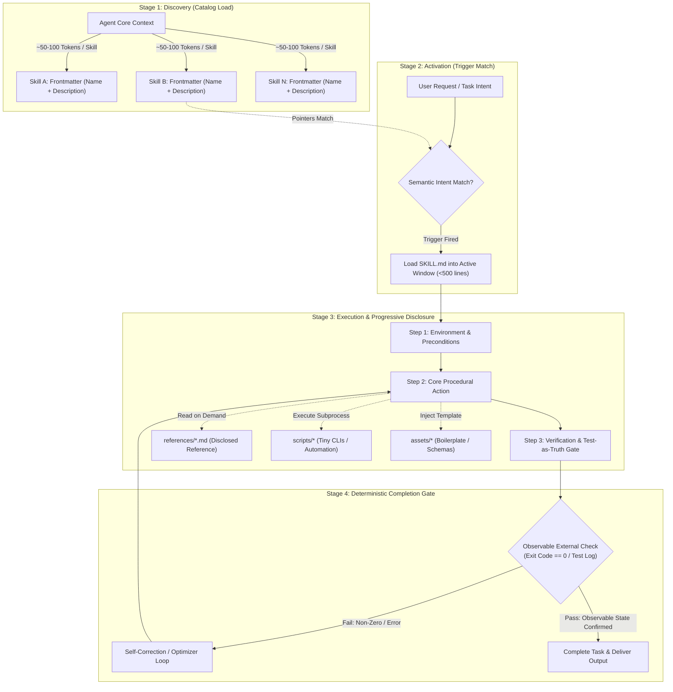
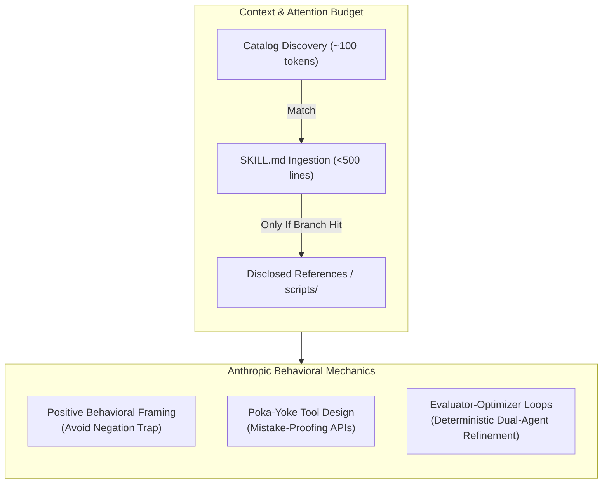
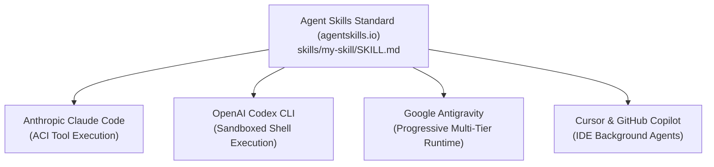
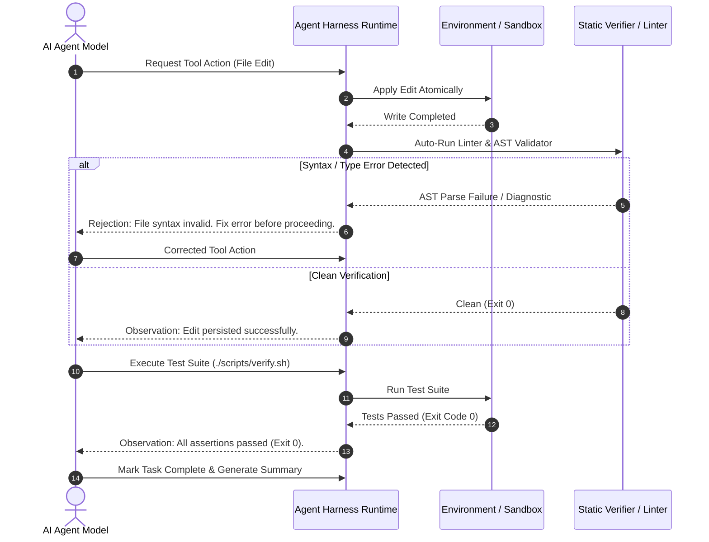
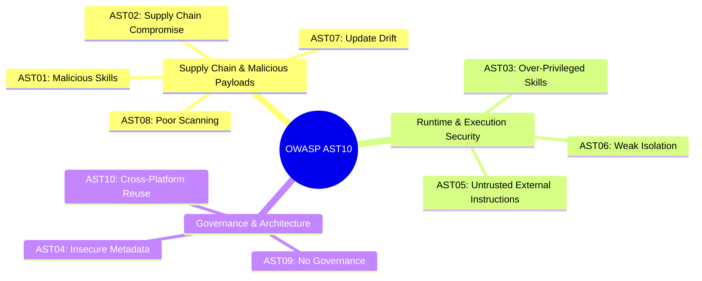
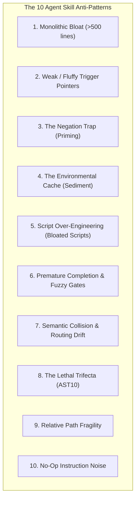
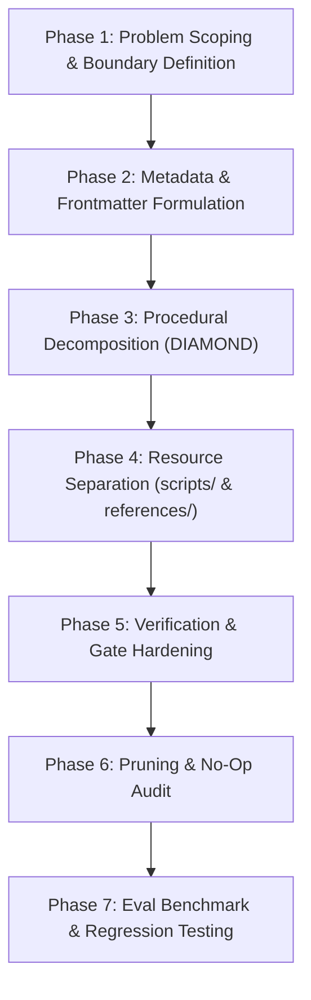

# Engineering Production AI Agent Skills: Architectural Best Practices, Standards, and Failure Modes Across Anthropic, OpenAI Codex, and Open Ecosystems

---

## 1. Executive Summary

As artificial intelligence systems transition from conversational interfaces to autonomous execution engines, the engineering discipline has shifted from prompt engineering to **harness engineering** and **agent skill architecture**. While modern foundation models (Claude 3.7/Sonnet 4.5, GPT-4o/o3/Codex, Gemini 2.5) possess extraordinary generalized reasoning, they suffer from cognitive limitations when operating autonomously over long horizons: attention dilution over long contexts ("lost in the middle"), susceptibility to semantic priming ("the negation trap"), execution rushing ("premature completion"), and tool-call hallucination.

To solve these systemic failure modes, the AI industry converged in late 2025 and early 2026 around the **Agent Skills open standard** (`agentskills.io`), originally spearheaded by Anthropic and rapidly adopted by OpenAI (Codex CLI, ChatGPT Agent Skills), Microsoft, GitHub Copilot, Google Antigravity, and Cursor. An **Agent Skill** is a modular, portable, version-controlled package that equips an agent with procedural domain knowledge, deterministic execution runbooks, mistake-proofed tools, and verifiable completion criteria.



Empirical synthesis of engineering practices across Anthropic and OpenAI reveals two complementary design philosophies that unify under the open standard:
1. **Anthropic's Cognitive Ergonomics Paradigm**: Prioritizes **progressive disclosure**, **poka-yoke tool simplification**, **positive behavioral framing**, and **lean documentation** (strictly capping `SKILL.md` under 500 lines) to minimize context saturation and cognitive load.
2. **OpenAI / Codex's Deterministic Systems Paradigm**: Prioritizes **single-purpose focus**, the **"Tiny CLIs" execution pattern** (scripts that run via shell, fail loudly, and produce deterministic `stdout`), **DIAMOND task framing**, and **verification-first ("test-as-truth") gates**, enforced through the **OWASP Agentic Skills Top 10 (AST10)** security posture.

This research report establishes an exhaustive, production-grade specification for designing, authoring, testing, and securing agent skills across frontier environments.

---

## 2. Primary Source Citations & References

The principles, metrics, and patterns articulated in this report derive directly from primary source literature, official engineering specifications, and architectural frameworks:

### 2.1 Anthropic Engineering & Research
1. **Erik Schluntz & Barry Zhang (Anthropic, 2024)**: *"Building Effective Agents"*, Anthropic Research & Engineering.
   - *Foundational Concepts*: The fundamental dichotomy between deterministic *Workflows* and open-ended *Autonomous Agents*; the five canonical agentic workflows (Prompt Chaining, Routing, Parallelization [Sectioning & Voting], Orchestrator-Workers, Evaluator-Optimizer); Agent-Computer Interface (ACI) ergonomics; poka-yoke (mistake-proofing) tool parameter design; reducing token formatting friction.
2. **Anthropic Engineering Staff (2025/2026)**: *"Claude Code Documentation: Skill Architecture & Authoring Guides"*, Anthropic Developer Platform.
   - *Foundational Concepts*: The 3-tier loading architecture; description-based discovery using third-person imperative declarations; positive framing versus negative instruction traps; directory containment models.
3. **Agent Skills Working Group (Anthropic, OpenAI, Cursor, et al., December 18, 2025)**: *"Agent Skills Open Specification"*, hosted at [agentskills.io](https://agentskills.io).
   - *Foundational Concepts*: Universal folder structure (`SKILL.md`, `scripts/`, `references/`, `assets/`, `evals/`); YAML frontmatter specification (`name`, `description`, `compatibility`, `allowed-tools`, `license`); the 500-line soft cap on instruction manifests; vendor-neutral discovery protocols.
4. **Anthropic Applied AI Team (2024/2025)**: *"Interactive Prompt Engineering & Tool Design Guidelines"*, Anthropic Documentation.
   - *Foundational Concepts*: Eliminating JSON-in-JSON escaping; atomic range editing versus git unified diff parsing; avoiding negative constraints to prevent concept priming.

### 2.2 OpenAI / Codex Engineering & Research
5. **Mark Chen, Jerry Tworek, Heewoo Jun, et al. (OpenAI, 2021/2024)**: *"Evaluating Large Language Models Trained on Code"*, arXiv:2107.03374, and *"OpenAI Codex & ChatGPT Agent Skills Specifications"*, OpenAI Developer Documentation.
   - *Foundational Concepts*: Single-purpose agent capability units; code-execution sandboxing; structured tool calling via the OpenAI Responses and Agents API.
6. **OpenAI Developer Experience Team (2025/2026)**: *"OpenAI Agents SDK & Cookbook: Building Deterministic Skills with Tiny CLIs"*, OpenAI Developer Platform.
   - *Foundational Concepts*: The "Tiny CLIs" design pattern (executable shell scripts with explicit flags, structured `stdout`, distinct non-zero exit codes, and loud stderr reporting); "test-as-truth" execution gates; context compaction pipelines.
7. **OpenAI Applied Research (2025)**: *"DIAMOND: A Structured Task Framing Framework for Agentic Workflows"*.
   - *Foundational Concepts*: Modular operational needs decomposition: **D**esired Outcome, **I**nputs & Preconditions, **A**ctions & Atomic Steps, **M**odalities & Tools, **O**utput Schemas, **N**egative Bounds ("Don't use when"), **D**eterministic Verification.
8. **OWASP Foundation (2025/2026)**: *"OWASP Top 10 for Agentic Skills (AST10)"*, OWASP GenAI / Agentic Security Project.
   - *Foundational Concepts*: AST01–AST10 risk taxonomy; mitigation of the "Lethal Trifecta" (sensitive data access + untrusted input exposure + outbound network egress); sandboxed execution and supply-chain auditing for skill packages.

### 2.3 Antigravity & Academic Foundations
9. **Google Antigravity Architecture & Customization Standards (2025/2026)**:
   - `writing-for-agents/SKILL.md` & `SKILL-MECHANICS.md`: The *Two Loads* (Context Load vs. Cognitive Load); Information Hierarchy (In-file step $\to$ In-file reference $\to$ Disclosed reference); Context Pointers; Leading Words; Completion Criteria (Clarity vs. Demand); Pruning Discipline (Single Source of Truth, Environment as Source of Truth, Sedimentation Elimination, No-Op Instruction Pruning).
10. **John Yang et al. (Princeton University, NeurIPS 2024)**: *"SWE-agent: Agent-Computer Interfaces Enable Automated Software Engineering"*, arXiv:2405.15793.
    - *Foundational Concepts*: Agent-Computer Interface (ACI) design; bounded pagination; atomic replacement versus sed/cat failures; automated linter verification hooks.

---

## 3. Core Architecture of an Agent Skill

An Agent Skill is not an unconstrained markdown file or an arbitrary prompt dump. It is a strictly structured capability package conforming to the `agentskills.io` specification.

### 3.1 Universal Directory Structure

Every compliant skill resides within a dedicated directory whose name matches the skill identifier:

```text
skills/<skill-name>/
├── SKILL.md                 # MANDATORY: Canonical manifest, frontmatter & core instructions
├── scripts/                 # OPTIONAL: Deterministic helper executables ("Tiny CLIs")
│   ├── prepare.py           # Setup / validation helper
│   └── verify.sh            # Deterministic test / lint verification script
├── references/              # OPTIONAL: Disclosed reference manuals, schemas & domain knowledge
│   ├── api-cheatsheet.md    # API endpoints & payload syntax
│   └── error-taxonomy.md    # Diagnostic trees for edge cases
├── assets/                  # OPTIONAL: Static assets, boilerplate templates & mock data
│   ├── template.json        # Output schema / template
│   └── fixture.sql          # Seed data for local reproduction
└── evals/                   # OPTIONAL: Test suites, prompt benchmarks & assertion matrices
    └── eval-matrix.json     # Input triggers and expected evaluation assertions
```

### 3.2 Anatomy of `SKILL.md`

`SKILL.md` is divided into two distinct components: **YAML Frontmatter** (ingested during catalog discovery) and the **Markdown Instruction Body** (ingested during skill activation).

```markdown
---
name: database-migration-runner
description: >-
  Execute and verify zero-downtime relational database schema migrations using
  Prisma or Liquibase. Use when modifying database schemas, applying new SQL
  migrations, or rolling back failed migration steps. Do not use for simple
  read-only SQL data queries.
version: 1.2.0
license: Apache-2.0
compatibility: ">=linux-x86_64, node>=18"
allowed-tools:
  - run_command
  - view_file
  - replace_file_content
metadata:
  domain: data-infrastructure
  tier: critical
---

# Database Migration Runner

## 1. Intent & Scope
Executes, validates, and rollbacks database migrations against staging and production
replicas, ensuring zero downtime and lock prevention.

## 2. Environment Verification & Preconditions
Verify database connectivity and current migration status before altering schema:
1. Run `./scripts/check-connection.sh` to ensure target database replica is accessible.
2. Run `npx prisma migrate status` to inspect drift.

## 3. Procedural Execution Steps
Follow these sequential actions strictly:
...
```

### 3.3 Strict Specification Requirements (`agentskills.io`)

| Field / Attribute | Requirement | Constraints & Rules |
| :--- | :--- | :--- |
| **`name`** | Mandatory | 1–64 characters. Lowercase alphanumeric and hyphens only (`^[a-z0-9-]+$`). Must exactly match parent directory name. |
| **`description`** | Mandatory | 1–1024 characters. Clear third-person imperative phrasing. Must state both **what** the skill does and **when** it triggers. |
| **`version`** | Optional | Semantic Versioning (`MAJOR.MINOR.PATCH`). |
| **`compatibility`** | Optional | Environment dependencies (OS, runtime versions, required binaries). |
| **`allowed-tools`** | Optional | Whitelist of tools the skill is authorized to invoke (prevents over-privilege). |
| **`disable-model-invocation`** | Optional (Antigravity/Claude) | Boolean. If `true`, strips the description from agent startup catalog, making the skill strictly user-invocable (`/skill-name`). |
| **Body Size Limit** | Soft Cap | **Under 500 lines of Markdown**. Bulky reference material must be pushed to `references/`. |

---

## 4. Anthropic's Best Practices for Skill Design

Anthropic’s engineering literature focuses on the **cognitive limitations and behavioral tendencies** of frontier language models. Large models do not fail from a lack of intelligence; they fail from context overload, attention dispersion, and formatting friction.



### 4.1 Progressive Disclosure & Context Conservation

A foundational finding in Anthropic's agent engineering is that **flooding the model's context window degrades downstream reasoning performance**. If an agent repository has 50 skills, injecting all 50 full instruction files into the system prompt would consume 30,000–50,000 tokens before the user even types a query.

To preserve the context budget:
1. **Catalog Phase (Startup)**: The harness parses only the YAML frontmatter (`name` and `description`). Each skill costs only ~50–100 tokens of baseline Context Load.
2. **Activation Phase (Matching)**: When a user prompt matches the semantic triggers in `description`, the harness reads `SKILL.md` into the conversation window.
3. **Execution Phase (Disclosed Branching)**: If the skill requires complex schemas, comprehensive API references, or detailed cheat sheets, these live in `references/` and are read into context *only when a specific execution branch demands it*.

### 4.2 Description-Based Discovery: Mechanics & Grammar

The `description` field is the single most critical string in the entire skill repository. It acts as the **context pointer** that governs whether the skill ever wakes up.

Anthropic mandates the following authoring rules for descriptions:
- **Third-Person Imperative Phrasing**: Write what the skill does and when the agent should activate it. Never write conversational chatter ("I can help you with...").
- **Front-Load the Leading Action Words**: Place the primary verb and noun within the first 5 words (`"Execute database migrations..."`, `"Review Git diffs against standards..."`).
- **Define Explicit Trigger Boundaries**: Clearly demarcate the invocation domain.
- **One Trigger per Functional Branch**: Avoid listing 10 synonyms for the same task. Redundant synonyms dilute attention.

```yaml
# POOR: Fluffy, first-person, weak trigger boundaries
description: I am a helpful assistant that can assist developers in debugging their React applications and fixing annoying bugs.

# EXCELLENT: Crisp, third-person, front-loaded leading words, clear trigger bounds
description: >-
  Debug React component state anomalies and performance regressions.
  Use when diagnosing React hook loops, unexpected component re-renders,
  or hydration mismatches in Next.js applications.
```

### 4.3 The 500-Line Soft Cap: Curing Attention Sprawl

Anthropic’s evaluations establish that when a prompt or instruction document exceeds 500 lines, the model’s adherence to nuanced rules drops precipitously. The model exhibits **attention sprawl**: it prioritizes beginning and ending tokens while losing intermediate operational rules.

- Keep `SKILL.md` strictly under **500 lines**.
- The main file must contain only:
  1. Intent and high-level boundaries.
  2. Sequential, step-by-step procedure.
  3. Hard verification gates and exit criteria.
- Move comprehensive error codes, legacy edge cases, and verbose API schemas to `references/<name>.md`. Link them via explicit markdown pointers: `[API Schema](./references/api-schema.md)`.

### 4.4 Positive Behavioral Framing vs. The Negation Trap

One of the most insidious failure modes in LLM steering is **The Negation Trap**:
When you instruct a model: *"Do NOT use `var`"* or *"Do NOT delete files"*, you explicitly inject the concepts `var` and `delete files` into the model's active attention window. Because negation particles ("not", "never", "don't") are weak syntactic modifiers compared to strong semantic tokens, the model's probability distribution is inadvertently primed to execute the forbidden behavior.

Anthropic’s prompt engineering standard requires **Positive Behavioral Framing**:
- Describe the **target behavior** you want to see, rather than the behavior you want to forbid.
- If a prohibition is strictly necessary, frame it as a deterministic negative boundary paired immediately with the positive alternative.

| Forbidden / Negative Framing (The Negation Trap) | Positive Target Framing (Anthropic Standard) |
| :--- | :--- |
| *"Do NOT write functions longer than 30 lines."* | *"Decompose all procedures into focused functions of 15–25 lines."* |
| *"Never use mutable state in Redux reducers."* | *"Produce new immutable state objects using spread syntax or Immer."* |
| *"Do NOT run migration scripts without checking backup."* | *"Verify backup snapshot creation using `./scripts/check-backup.sh` before running migrations."* |
| *"Don't use any relative file paths in your tool calls."* | *"Always supply absolute file paths starting from the workspace root."* |

### 4.5 Tool Simplification & Poka-Yoke (Mistake-Proofing)

Anthropic’s research (*Building Effective Agents*, 2024) reveals that complex tool interfaces are the leading cause of agent crashes. Models frequently fail when forced to generate complex escaping, calculate character offsets, or format multi-line patches.

**Poka-yoke** (ポカヨケ, mistake-proofing) principles for skill tools:
1. **Eliminate JSON-in-JSON Escaping**: Never design tools where a model must escape JSON strings inside a JSON argument string. Provide plain text or separate typed parameters.
2. **Eliminate Git Diff Chunk Line Counting**: Models struggle to calculate diff hunk headers like `@@ -14,7 +14,9 @@`. Skills should use atomic replacement tools (e.g., matching unique strings via `replace_file_content`) rather than expecting unified diffs.
3. **Mandate Absolute Paths**: Shell tools allowing relative paths suffer from working-directory state drift when an agent runs `cd`. All skill commands must accept absolute paths or resolve against an explicit root environment variable.
4. **Structured Error Feedback**: When a tool fails, return an actionable diagnosis rather than a stack trace. For example: `"Error: TargetContent not found. Ensure StartLine and EndLine accurately enclose the exact lines to replace."`

### 4.6 Evaluator-Optimizer Workflows

For mission-critical tasks (code refactoring, security reviews, contract generation), a single generation pass is insufficient. Anthropic recommends embedding an **Evaluator-Optimizer loop** into the skill procedure:
- **Phase A (Generation)**: The agent drafts the implementation or modification.
- **Phase B (Evaluation)**: A dedicated linter, test suite, or secondary evaluation agent reviews the artifact against a strict rubric.
- **Phase C (Optimization)**: The agent refines the output based exclusively on the evaluator’s concrete feedback until all assertions pass.

---

## 5. OpenAI / Codex's Best Practices for Skill Design

OpenAI’s engineering literature and Codex CLI guidelines focus heavily on **computational determinism, code-driven execution, and verification**. OpenAI treats agents not merely as conversational reasoners, but as operators of sandboxed computer environments.

```mermaid
flowchart LR
    subgraph DIAMOND_Framework["DIAMOND Task Framing Architecture"]
        direction TB
        D1["D: Desired Outcome (Explicit Objective)"]
        I1["I: Inputs & Context (Files, Envs, State)"]
        A1["A: Actions (Atomic Step-by-Step Procedure)"]
        M1["M: Modalities (Tiny CLIs, Shell, Tools)"]
        O1["O: Outputs (Strict Artifacts & Schema)"]
        N1["N: Negative Bounds ('Don't Use When')"]
        D2["D: Deterministic Verification (Test-as-Truth)"]
    end
    
    subgraph TinyCLI["'Tiny CLIs' Pattern"]
        CLI1["Deterministic stdout"]
        CLI2["Exit Code 0 (Success) / Non-Zero (Fail)"]
        CLI3["Loud stderr Error Output"]
    end

    DIAMOND_Framework --> TinyCLI
```



### 5.1 Single-Purpose Focus & The "Tiny CLIs" Pattern

OpenAI strongly advocates against creating "Swiss Army knife" skills that attempt to handle entire software engineering domains. A skill should do **one coherent thing with high reliability**.

When automation is required, OpenAI recommends encapsulating complex execution sequences into **"Tiny CLIs"** inside `scripts/`:
- **Executable via Standard Shell**: Designed to run as `./scripts/my-tool --flag arg`.
- **Deterministic Standard Output**: Print structured, parseable text (or compact JSON) that the model can interpret effortlessly.
- **Loud Failures on `stderr`**: When an error occurs, print the exact failure reason to `stderr` and exit with a non-zero code. Never swallow errors or return exit code 0 on failure.
- **File-Driven Outputs**: For large data, write output to an explicit file path on disk and return only a summary and path to the agent context. This prevents context flooding.

### 5.2 The DIAMOND Task Framing Framework

To eliminate ambiguity and structure agent execution, OpenAI projects apply the **DIAMOND** task framing model within `SKILL.md`:

```text
D - Desired Outcome:   The explicit, measurable business objective.
I - Inputs & Context:  Prerequisites, environment variables, target files, schemas.
A - Actions:           Sequential, atomic, repeatable execution steps.
M - Modalities:        Exact tools and execution runtimes (bash, python, node).
O - Output Schemas:    Exact structure and formatting of deliverables.
N - Negative Bounds:   Explicit "Don't use when" conditions and anti-scope boundaries.
D - Deterministic Ver: Test-as-truth verification commands (Definition of Done).
```

### 5.3 Verification-First & "Test-as-Truth"

A primary failure mode documented in OpenAI Codex benchmarks is **premature completion via semantic self-assessment**: an agent inspects its own code edits, hallucinates that the change is correct, and concludes the task without executing tests.

OpenAI enforces the **Test-as-Truth** doctrine:
- **Language models are probabilistic; execution environments are deterministic.**
- The model's internal belief that code works is irrelevant. Only the operating system's exit status constitutes proof of completion.
- Every skill must end with an explicit verification command:
  ```bash
  pytest tests/test_migrations.py -v
  # OR
  npm test -- --grep "Authentication"
  ```
- The skill instructions must mandate: *"Do not mark this task complete until the verification command exits with code 0. If it fails, inspect the output, formulate a fix, apply changes, and re-run verification."*

### 5.4 Trigger Clarity: "Use when" vs. "Don't use when"

OpenAI models excel at boundary compliance when provided with explicit contrastive boundaries. A skill's description and overview should explicitly state both positive triggers and negative exclusions.

```markdown
### Trigger Conditions
- **Use when**:
  - Refactoring Python code from synchronous `requests` to asynchronous `httpx`.
  - Adding connection pooling and retry logic to async API client classes.
- **Don't use when**:
  - Writing web scraper scripts using Playwright or Selenium.
  - Designing raw asyncio socket servers or WebSocket streaming endpoints.
```

### 5.5 Handling Semantic Overlap & Routing Ambiguity

When a repository contains dozens of skills, semantic overlap becomes a critical threat. For example, if a team has `python-formatter`, `python-linter`, and `python-refactor`, the model may hesitate or pick the wrong skill.

OpenAI’s routing strategies:
1. **Vertical Consolidation**: Merge hyper-narrow micro-skills that operate on the same lifecycle into a unified skill with internal branches (e.g., `python-code-quality` with `format`, `lint`, and `refactor` modes).
2. **Explicit Disambiguation in Descriptions**: State the boundary in the description:
   ```yaml
   description: >-
     Perform deep architectural refactoring of Python classes.
     Use for structural refactors, not for simple PEP8 linting (use ruff-lint instead).
   ```

---

## 6. Comparative Analysis: Anthropic vs. Codex / OpenAI

While Anthropic and OpenAI converge on the file structure defined by `agentskills.io`, their runtime execution engines and prompt optimization cultures exhibit distinct nuances.

### 6.1 Architectural Comparison Matrix

| Dimension | Anthropic Ecosystem (Claude Code / Agent Skills) | OpenAI / Codex Ecosystem (Codex CLI / Agents SDK) | Harmonized Open Standard (`agentskills.io`) |
| :--- | :--- | :--- | :--- |
| **Manifest Format** | `SKILL.md` with YAML frontmatter. | `SKILL.md` with YAML frontmatter. | Mandatory `SKILL.md` with YAML frontmatter. |
| **Discovery Mechanism** | Startup catalog injection of `name` and `description` (~50–100 tokens). | Metadata registry / function calling tool definition lookup. | Catalog-level discovery via metadata frontmatter. |
| **Description Style** | Third-person imperative, trigger-focused ("Use when..."). | Capability and boundary declaration ("Use when" vs "Don't use when"). | Third-person, action-oriented, under 1024 characters. |
| **Instruction Sizing** | Strict soft cap under 500 lines; heavy reliance on progressive disclosure. | Modular instructions with DIAMOND task framing. | Under 500 lines for core manifest; offload to `references/`. |
| **Execution Medium** | Native ACI tools (`view_file`, `replace_file_content`, bash). | "Tiny CLIs" executed in sandboxed shell / Python environments. | Composable mix of native agent tools and shell scripts. |
| **Error Steering** | Positive behavioral framing; elimination of negative priming. | Negative bounds, assertion logging, explicit error-handling steps. | Positive framing for style; explicit negative boundaries for scope. |
| **Verification Gate** | Evaluator-Optimizer loops and empirical state observation. | "Test-as-Truth" (exit code 0 required before termination). | Deterministic verification criteria with observable state check. |
| **Security Model** | Tool permission confirmation; sandboxed environments. | AST10 security model; strict argument validation; non-root execution. | Minimal privilege, sandboxed execution, auditable scripts. |

### 6.2 Convergence on the Open Standard (`agentskills.io`)

The release of the Agent Skills open standard on December 18, 2025 marked the end of fragmented, vendor-locked agent prompt formats. A skill authored to the standard functions interchangeably across:
- **Anthropic Claude Code**: Discovered via `.claude/skills/` or `skills/`.
- **OpenAI Codex CLI**: Discovered via `.codex/skills/` or `skills/`.
- **Google Antigravity**: Discovered via `.agents/skills/`, `.gemini/config/skills/`, or workspace root.
- **GitHub Copilot & Cursor**: Discovered via workspace agent configuration folders.



### 6.3 Platform-Specific Execution Nuances

Despite manifest parity, skill authors must account for platform execution quirks:
- **Shell Differences**: OpenAI environments frequently execute in standard Linux bash containers. Windows environments (e.g., PowerShell on Antigravity/Windows) require cross-platform scripts (Python/Node) in `scripts/` rather than bash-only `.sh` scripts.
- **Path Separators**: Never hardcode forward slashes or backslashes into python scripts. Always use `pathlib.Path` or `os.path.join`.
- **Tool Naming**: While Claude Code provides `Edit` or `replace_file_content`, OpenAI Codex often exposes bash execution directly. Skills should use standard relative links to script files (`./scripts/run.py`) rather than hardcoding vendor-specific tool names into the instruction body.

---

## 7. Information Architecture & Token Economics

Writing a high-performance skill requires managing token expenditure and cognitive budgets. Every instruction added to a skill exerts a tangible financial and computational cost on every turn of the agent's execution.

### 7.1 The Two Loads (Antigravity Architecture)

In the Antigravity customization philosophy, every document and pointer you introduce spends one of two finite budgets:
1. **Context Load**: The permanent token cost imposed on the LLM's active context window on every conversation turn. A skill's `description` spends Context Load at all times. A skill's full body spends Context Load as long as the skill remains activated.
2. **Cognitive Load**: The mental overhead imposed on the human engineer. Which skills exist? When should they be manually invoked? The human is the mental index.

```mermaid
quadrantChart
    title The Two Loads: Architecture Tradeoff Space
    x-axis Low Cognitive Load --> High Cognitive Load (Human must index)
    y-axis Low Context Load --> High Context Load (Tokens spent every turn)
    quadrant-1 Antipattern: Bloated Always-On Prompts
    quadrant-2 Antipattern: Massive System Prompts
    quadrant-3 Ideal Model-Invoked Skill (Progressive Disclosure)
    quadrant-4 User-Invoked Router Skills (disable-model-invocation: true)
    "Monolithic System Prompt": [0.1, 0.9]
    "Raw Unstructured Instructions": [0.3, 0.8]
    "agentskills.io Model-Invoked": [0.2, 0.2]
    "User-Only Specialist (/skill)": [0.8, 0.15]
    "Disclosed Reference Files": [0.25, 0.1]
```

To optimize both budgets:
- If a skill must trigger autonomously, accept a tiny Context Load (~50 tokens for the `description`) and zero Cognitive Load.
- If a skill is dangerous, specialized, or only run once a quarter by a human, set `disable-model-invocation: true`. This drops Context Load to **zero tokens**, paying only in human Cognitive Load.

### 7.2 The 3-Stage Progressive Disclosure Ladder

```text
+---------------------------------------------------------------+
| STAGE 1: CATALOG / DISCOVERY                                  |
| Loaded: name + description (~50-100 tokens permanently)       |
| Role: Sits in context window; semantic pointer awaiting match |
+-------------------------------+-------------------------------+
                                | (User intent matches trigger)
                                v
+---------------------------------------------------------------+
| STAGE 2: INSTRUCTION ACTIVATION                               |
| Loaded: SKILL.md body (200-500 lines / ~800-2,000 tokens)     |
| Role: Sequential procedural steps & verification gates        |
+-------------------------------+-------------------------------+
                                | (Specific branch hit in Step)
                                v
+---------------------------------------------------------------+
| STAGE 3: RESOURCE EXECUTION                                   |
| Loaded: references/*.md, assets/*.json, or scripts/ execution |
| Role: Specialized domain payloads consumed only on demand    |
+---------------------------------------------------------------+
```

The progressive disclosure ladder ensures that an agent repository can scale to hundreds of skills without causing context rot.

### 7.3 Information Hierarchy & Co-Location

Within `SKILL.md`, information is structured into three distinct tiers:
1. **In-File Step**: The ordered actions the agent performs. These must be prominent, linear, and unambiguous.
2. **In-File Reference**: Short definitions, critical rules, or parameter bounds that apply to *all* steps.
3. **Disclosed Reference**: Bulky schemas, edge-case trees, or external API tables pushed to `references/`.

**Co-Location Principle**: Keep a concept's definition, rules, verification steps, and caveats grouped under a single heading. Scattering caveats across the file forces the model to synthesize fragmented tokens, increasing error variance.

### 7.4 Vocabulary Anchoring via Leading Words

A **Leading Word** is a compact, high-entropy concept already established in the foundation model’s pretraining weights (e.g., *tight loop*, *red-green-refactor*, *poka-yoke*, *tracer bullet*, *atomic*).

Instead of spending 150 tokens explaining:
> *"Make sure your edit changes only the exact lines required without altering adjacent whitespace or unmentioned code blocks, and check that the file remains syntactically valid."*

Anchor the behavior using the pretrained leading word:
> *"Perform an **atomic** line replacement. Verify syntax immediately."*

By recruiting priors the model already holds, leading words drastically reduce context load while sharpening behavioral consistency.

### 7.5 The Pruning Discipline

Agent skills are living codebases. Over time, skill files degrade into **sediment**: layers of stale instructions, obsolete CLI flags, and defensive rules accumulated from ancient bugs.

Skill authors must enforce four pruning rules:
1. **Single Source of Truth**: Every domain constraint lives in exactly one authoritative file. Never duplicate instructions across `AGENTS.md`, `CLAUDE.md`, and individual skills.
2. **Environment as Source of Truth (No Caching)**: The repository itself (`package.json`, `Cargo.toml`, directory layout, CLI `--help` output) is the ground truth. Documenting command options in a skill creates a **stale cache**. Instruct the agent to inspect the environment dynamically: `"Inspect package.json to identify the active test runner."`
3. **The No-Op Instruction Test**: Sentence by sentence, test whether an instruction changes model behavior relative to its default baseline. If a modern frontier model already writes clean, typed code by default, delete *"Ensure code is clean and properly typed"*. It is a **no-op** that wastes attention.
4. **Ruthless Elimination of Sediment**: Frequently audit and delete legacy workarounds. Shorter documents maintain higher attention density.

---

## 8. Robustness, Determinism & Execution Gates

The difference between a toy demo and an enterprise agent skill lies in how the skill enforces **execution bounds and completion criteria**.



### 8.1 Completion Criteria: Clarity vs. Demand

Every procedural step and skill must terminate on an explicit **completion criterion**. A completion criterion operates via two levers:
- **Clarity**: Is the criterion checkable and unambiguous? (Binary observable state: *"Exit code is 0"* vs. Fuzzy state: *"Ensure the logic is sound"*).
- **Demand**: How much exhaustive legwork does the criterion demand? (*"Produce a list of changed files"* has low demand; *"Every call-site across the repository accounted for with passing integration tests"* has high demand).

The highest-performing skills combine **high clarity** with **high demand**.

### 8.2 Defeating the Post-Completion Rush

When an agent executes an early investigative step in a multi-step document, it can see the remaining implementation and conclusion steps sitting downstream in its context window. These downstream steps exert a powerful cognitive pull: the agent rushes through the investigation to reach the finish line (**The Post-Completion Rush**).

To prevent premature completion:
1. **Sharpen the intermediate bound**: Make the transition gate empirical. *"Do not proceed to Step 3 until `./scripts/check-preconditions.sh` returns exit code 0 and outputs `VALIDATED`."*
2. **Context Boundary Splitting**: If a task requires deep, open-ended research before code modification, dispatch the research to an isolated **subagent**. The subagent’s context window contains *only* the investigation instructions; the downstream implementation steps are physically absent from its context, completely eliminating the rush.

### 8.3 Testing Skills with Evals & Test Matrices

Skills must be validated with automated evaluation harnesses just like traditional software:
- **Invocation Eval**: Present the agent with 100 diverse user prompts (50 in-domain, 50 out-of-domain). Measure precision and recall of skill activation based on the `description`.
- **Execution Eval**: Run the skill inside disposable Docker/git sandboxes against known bug reproductions or feature specs. Assert that:
  1. The final exit code is 0.
  2. No extraneous or forbidden files were modified.
  3. Intermediate verification gates were executed in proper order.
  4. Total token expenditure remains within budget.

### 8.4 OWASP Agentic Skills Top 10 (AST10) & Security Posture

Skills execute real code, modify databases, and interact with operating systems. The OWASP Foundation formalized the 10 critical security risks for agent skills:



| AST ID | Vulnerability Name | Skill Authoring Attack Vector | Mitigation in Skill Architecture |
| :--- | :--- | :--- | :--- |
| **AST01** | **Malicious Skills** | Skill bundle contains hidden backdoor or credential stealer in `scripts/`. | Cryptographic signing of skill folders; strict code review of all bundled executables. |
| **AST02** | **Supply Chain Compromise** | Skill pulls unpinned dependencies from external registries during runtime. | Freeze all package versions; vendor dependencies inside skill or sandbox image. |
| **AST03** | **Over-Privileged Skills** | Skill requests blanket `bash` or `root` permissions when only file viewing is needed. | Use `allowed-tools` in frontmatter to restrict tool permissions to minimum viable set. |
| **AST04** | **Insecure Metadata** | Missing or ambiguous description triggers unintentional execution on untrusted prompts. | Precise trigger phrasing; explicit negative boundaries ("Don't use when"). |
| **AST05** | **Untrusted External Instructions** | Indirect prompt injection via ingested files/webpages overrides skill instructions. | Treat file/web content as untrusted data; never execute raw strings parsed from external inputs. |
| **AST06** | **Weak Isolation** | Skill executes commands directly on host machine rather than isolated container. | Mandate containerized sandboxes (Docker/microVMs) with ephemeral storage. |
| **AST07** | **Update Drift** | Script dependencies change over time, breaking assumptions or introducing CVEs. | Lockfile pinning (`package-lock.json`, `poetry.lock`) in skill directories. |
| **AST08** | **Poor Scanning** | Deploying skills without static analysis or vulnerability scanning. | Pre-commit SAST scanning for shell scripts, python scripts, and prompt injection patterns. |
| **AST09** | **No Governance** | Organization has no centralized registry or ownership audit for active skills. | Maintain an internal catalog with explicit ownership, versioning, and deprecation policies. |
| **AST10** | **Cross-Platform Reuse** | Reusing a Linux-tailored skill on Windows causes unhandled shell execution failures. | Use platform-agnostic runners (Node/Python); declare `compatibility` in frontmatter. |

#### Mitigating "The Lethal Trifecta"
The most dangerous failure state in agent security occurs when a skill combines:
1. **Access to Sensitive Data** (e.g., SSH keys, credentials, local source code).
2. **Exposure to Untrusted Input** (e.g., untrusted PR comments, web scraping, external user issues).
3. **Outbound Network Connectivity** (e.g., curl, webhook dispatch).

If an attacker injects an instruction via untrusted input, the agent can exfiltrate sensitive data over the outbound connection.
**Architectural Rule**: Skills that ingest untrusted external content must operate in air-gapped sandboxes with outbound network access blocked at the harness network bridge.

---

## 9. Canonical Reference Templates & Concrete Examples

### 9.1 Universal Canonical `SKILL.md` Reference Template

```markdown
---
name: service-health-auditor
description: >-
  Audit microservice operational health, API latency regressions, and container
  crash loops. Use when diagnosing failing service endpoints, Kubernetes pod
  CrashLoopBackOff events, or elevated error rates reported in observability alerts.
  Do not use for static code linting or database schema migrations.
version: 1.0.0
license: MIT
compatibility: ">=linux-x86_64, python>=3.11"
allowed-tools:
  - run_command
  - view_file
metadata:
  owner: sre-platform
  criticality: high
---

# Service Health Auditor

## 1. Desired Outcome & Scope
Identify root causes of service degradation, quantify latency regressions, and generate
an actionable incident remediation report with verified reproduction steps.

## 2. Environment Verification & Preconditions
Before executing diagnostic checks, establish target environment baseline:
1. Run `./scripts/check_cluster.py --check-auth` to verify cluster API credentials.
2. Verify target namespace exists: `kubectl get namespace $TARGET_NAMESPACE`.

## 3. Diagnostic & Execution Steps

### Step 1: Pod State & Event Audit
Execute the cluster health inspector script:
`./scripts/audit_pods.py --namespace $TARGET_NAMESPACE --output /tmp/pod-audit.json`

Examine `/tmp/pod-audit.json`. For any container with `restartCount > 0`:
- Read latest termination message.
- Capture crash logs using: `kubectl logs $POD_NAME --previous --tail 100`.

### Step 2: Metric Anomaly Correlation
Inspect latency spikes against baseline using the reference metric playbook:
[Metric Diagnostic Reference](./references/metric-diagnostics.md)

Cross-reference error spike timestamps with deployment revisions:
`kubectl rollout history deployment/$DEPLOYMENT_NAME -n $TARGET_NAMESPACE`

## 4. Verification & Test-as-Truth Gate
Confirm diagnosis completeness by validating against the audit rubric:
1. Run the deterministic assertion validator:
   `./scripts/verify_audit.py --report /tmp/pod-audit.json`
2. **Termination Requirement**: Script must exit with code 0. If non-zero, resolve missing
   diagnostic fields and re-execute verification.

## 5. Output Deliverables
Produce an incident summary formatted strictly to the template in:
[Incident Report Template](./assets/report-template.md)
```

---

### 9.2 Concrete Production Example 1: Anthropic-Optimized Code Review Skill

This skill demonstrates **progressive disclosure**, **poka-yoke tool simplification**, **positive behavioral framing**, and an **evaluator-optimizer loop**.

```markdown
---
name: strict-code-reviewer
description: >-
  Review pull request git diffs against architectural standards and domain specs.
  Use when conducting automated PR reviews, validating branch changes before merge,
  or evaluating code adherence to repository conventions. Do not use for automated
  code formatting or dependency security scans.
version: 2.1.0
license: Apache-2.0
allowed-tools:
  - run_command
  - view_file
---

# Strict Code Reviewer

## 1. Intent
Deliver an objective, high-signal pull request review that verifies code correctness,
architectural consistency, and test coverage while eliminating nitpicks.

## 2. Review Protocol

### Step 1: Scope & Diff Inspection
1. Determine the merge base and inspect modified files:
   `git merge-base HEAD origin/main`
2. Capture the changed files list without unified diff line headers:
   `git diff --name-only $(git merge-base HEAD origin/main)...HEAD`

### Step 2: Dual-Axis Standards Audit
Review every modified file across two independent criteria:

1. **Repository Standards Axis**:
   - Check against repository architectural rules: [Repo Coding Standards](./references/coding-standards.md).
   - Ensure every new function carries explicit input/output type annotations.
   - Verify error handling uses domain-specific error classes rather than bare exceptions.

2. **Specification & Test Completeness Axis**:
   - Check that every modified business logic branch contains a corresponding automated unit test.
   - Verify tests follow the red-green structure: arrange, act, assert.

### Step 3: Evaluator-Optimizer Critique Loop
Before posting the review, execute the critique rubric:
- Filter out purely stylistic comments that automated linters (e.g., Prettier/Ruff) already catch.
- Ensure all comments cite specific file paths and line numbers using absolute markdown links.
- Frame all feedback with actionable replacement suggestions:
  *"Replace mutable dictionary default with `None` and instantiate within body."*

## 3. Observable Completion Gate
Run the automated review validator:
`python ./scripts/validate_review.py --input /tmp/review-draft.json`

**Completion Gate**: The validator must return `VALIDATION_PASSED` (exit code 0).
Output the final structured review markdown only after the gate succeeds.
```

---

### 9.3 Concrete Production Example 2: OpenAI/Codex-Optimized Migration Skill

This skill demonstrates **DIAMOND task framing**, the **"Tiny CLIs" pattern**, explicit **"Use when" vs "Don't use when" triggers**, **AST10 security guardrails**, and **test-as-truth verification**.

```markdown
---
name: zero-downtime-migration
description: >-
  Plan, execute, and verify zero-downtime relational database schema migrations.
  Use when altering PostgreSQL/MySQL database tables, adding columns with defaults,
  creating concurrent indexes, or executing multi-step table rewrites.
  Do not use for read-only SQL queries or non-relational database stores.
version: 3.0.0
license: MIT
compatibility: ">=linux-x86_64, python>=3.11"
allowed-tools:
  - run_command
  - view_file
  - replace_file_content
metadata:
  ast10-compliance: audited
  sandbox: required
---

# Zero-Downtime Database Migration Runner

## 1. Desired Outcome (DIAMOND: D)
Execute a schema modification against a live relational database without incurring table
exclusive locks exceeding 50ms, while preserving backward compatibility with running app servers.

## 2. Inputs & Context (DIAMOND: I)
- Target SQL migration script path.
- Database connection string via `$DATABASE_URL` (injected via secure secret store; never hardcoded).
- Schema locking guidelines: [PostgreSQL Lock Playbook](./references/postgres-locks.md).

## 3. Actions & Modalities (DIAMOND: A & M)

### Step 1: Pre-Execution Safety Linting (Tiny CLI)
Run the migration linter CLI to check for dangerous lock patterns:
`./scripts/lint_migration.py --file $MIGRATION_FILE`

The linter validates against AST05/AST06 and schema hazards:
- Disallows `ALTER TABLE ADD COLUMN` with non-null constraints lacking defaults.
- Mandates `CREATE INDEX CONCURRENTLY`.
- Validates statement timeouts are set (`SET lock_timeout = '2s';`).

*Gate*: If `lint_migration.py` returns non-zero, the migration is rejected. Refactor the SQL.

### Step 2: Dry-Run in Transactional Sandbox
Execute the migration against the local ephemeral test database:
`./scripts/migrate_sandbox.sh --file $MIGRATION_FILE --dry-run`

Observe terminal output. Verify that rollback logic succeeds cleanly:
`./scripts/migrate_sandbox.sh --file $MIGRATION_FILE --test-rollback`

### Step 3: Target Application Verification
Execute target migration in the designated environment:
`./scripts/execute_migration.py --file $MIGRATION_FILE`

## 4. Deterministic Verification Gate (DIAMOND: D)
Confirm database health and lock resolution:
1. Run: `./scripts/verify_db_health.py --timeout 10`
2. Run test suite: `pytest tests/integration/test_db_models.py -v`

**Definition of Done (Test-as-Truth)**:
- Both scripts must terminate with exit code 0.
- Zero orphaned locks observed in `pg_stat_activity`.
- If any test fails, automatically invoke `./scripts/rollback.sh $MIGRATION_FILE` and abort.

## 5. Output Deliverables (DIAMOND: O)
Produce migration execution receipt to `migrations/history/receipt-[timestamp].json` containing:
- Execution start and end timestamps.
- Maximum lock duration observed.
- Applied schema version hash.
```

---

## 10. Catalog of Anti-Patterns & Failure Modes to Avoid

Empirical analysis across thousands of agent runs reveals ten recurring failure modes in skill authoring.



### 10.1 Detailed Anti-Pattern Taxonomy

#### 1. The Monolithic Bloat
- **Symptom**: Author writes an 800+ line `SKILL.md` packing background theory, database schemas, API specs, and tutorials into a single file.
- **Consequence**: The agent’s attention window is flooded upon activation. Adherence to core procedural steps drops to a statistical coin-flip ("lost in the middle").
- **Correction**: Split the document according to the Information Hierarchy. Keep `SKILL.md` under 500 lines strictly for procedural steps; offload schemas to `references/*.md`.

#### 2. Weak / Fluffy Trigger Pointers
- **Symptom**: Frontmatter `description` contains conversational fluff: `"This skill helps the agent understand how to perform operations on our system."`
- **Consequence**: The agent's intent matcher cannot determine when to trigger the skill. The skill suffers from high false-negative rates (never invoked) or false-positive misrouting.
- **Correction**: Rewrite as a crisp, third-person imperative context pointer starting with leading action verbs: `"Run database backups and verify snapshot integrity. Use when..."`.

#### 3. The Negation Trap
- **Symptom**: Attempting to steer the agent using heavy negative prohibitions: *"Do NOT use unindexed queries. Do NOT touch production tables."*
- **Consequence**: Semantic concept priming. The model is primed with the forbidden concept and frequently executes the exact forbidden behavior.
- **Correction**: Prompt the positive target behavior: *"Target queries using indexed primary and secondary keys. Restrict operations strictly to staging database targets."*

#### 4. The Environmental Cache
- **Symptom**: Documenting lists of npm commands, CLI options, or directory trees that already exist in the repository (`package.json`, `tsconfig.json`, `git status`).
- **Consequence**: As the codebase evolves, the skill document drifts out of sync. The instructions become stale **sediment**, confusing the agent.
- **Correction**: Treat the **environment as the single source of truth**. Instruct the agent to read `package.json` or run `npm run` directly. Cache in a skill *only* what cannot be discovered by inspection.

#### 5. Script Over-Engineering
- **Symptom**: Author writes complex, 600-line Python scripts in `scripts/` with dynamic reflection, external micro-frameworks, and complex dependency graphs.
- **Consequence**: The helper scripts break due to environment mismatch, missing packages, or unhandled OS errors, leaving the agent stranded.
- **Correction**: Adhere to the **"Tiny CLIs"** pattern. Write simple, standalone scripts with zero or minimal external dependencies. Print clean `stdout`, fail loudly on `stderr`, and exit with distinct codes.

#### 6. Premature Completion & Fuzzy Gates
- **Symptom**: A step concludes on a subjective, self-assessed criterion: *"Verify that the code looks elegant and well-structured."*
- **Consequence**: The model rushes to complete the task without actually verifying execution, declaring success on broken code.
- **Correction**: Enforce **Test-as-Truth**. Terminate steps on binary, checkable, empirical conditions: exit code 0 from a test runner, linter, or validation script.

#### 7. Semantic Collision & Routing Ambiguity
- **Symptom**: Multiple skills possess overlapping, ambiguous descriptions (e.g., `git-helper`, `git-committer`, `git-branch-manager`).
- **Consequence**: The agent flips between skills inconsistently, or triggers multiple competing skills simultaneously, saturating context.
- **Correction**: Consolidate overlapping micro-skills into a single coherent capability, or add explicit negative boundary triggers: *"Use for creating branches; do not use for writing commit messages (use git-commit instead)."*

#### 8. The Lethal Trifecta (AST10)
- **Symptom**: A skill accepts untrusted external input (e.g., webhook payload or scraped issue description), has access to private credentials, and can make arbitrary outbound network calls.
- **Consequence**: Indirect prompt injection allows external attackers to steal credentials and exfiltrate codebase secrets.
- **Correction**: Enforce AST05/AST06 mitigations: strip outbound network access in sandboxes handling untrusted inputs; restrict tool execution permissions via `allowed-tools`.

#### 9. Relative Path Fragility
- **Symptom**: Instructions and scripts rely on relative paths (`./build.sh`, `../../config.json`) assuming a fixed working directory.
- **Consequence**: When the agent changes directory (`cd frontend`), subsequent tool calls fail with `FileNotFoundError`, inducing cascading retries.
- **Correction**: Require absolute paths or resolve all file operations against an environment root variable (`$WORKSPACE_ROOT`).

#### 10. No-Op Instruction Noise
- **Symptom**: Skill includes generic advice: *"Think carefully before answering"*, *"Write bug-free, robust code"*, *"Be polite and helpful"*.
- **Consequence**: Wasted context tokens and attention dilution with zero behavioral delta.
- **Correction**: Apply the **No-Op Test**: if a frontier model already performs the behavior by default, delete the sentence completely.

---

## 11. Authoring Runbook: Step-by-Step Skill Creation Guide

Follow this 7-phase runbook when engineering a new agent skill for production deployment:



### Phase 1: Problem Scoping & Boundary Definition
1. Define the single, coherent capability the skill provides.
2. Determine if the skill is **model-invoked** (triggered autonomously by the agent) or **user-invoked** (triggered only by explicit user command `/skill-name`).
3. If user-invoked, add `disable-model-invocation: true` to frontmatter to save Context Load.

### Phase 2: Metadata & Frontmatter Formulation
1. Name the skill using lowercase alphanumeric characters and hyphens (`^[a-z0-9-]+$`).
2. Author the `description` (under 1024 characters):
   - Third-person imperative phrasing.
   - Front-load primary action verbs.
   - Include positive triggers: *"Use when..."*.
   - Include negative boundaries: *"Do not use when..."*.
3. Specify `allowed-tools` to limit execution privileges.

### Phase 3: Procedural Decomposition (DIAMOND)
1. Frame the workflow using DIAMOND:
   - **D**: Define measurable desired outcome.
   - **I**: List prerequisites, secrets, and environment dependencies.
   - **A**: Specify sequential, ordered execution steps.
   - **M**: Designate exact tool and execution modalities.
   - **O**: Define output artifacts and schemas.
   - **N**: Reiterate non-goals and scope limits.
   - **D**: Define empirical completion verification.
2. Frame all instructions with **positive target behaviors**. Eliminate negative prohibitions.

### Phase 4: Resource Separation (`scripts/` & `references/`)
1. Audit line count: Ensure `SKILL.md` is strictly under **500 lines**.
2. Offload detailed tables, dictionaries, and error guides to `references/<name>.md`.
3. Offload multi-step shell automation to standalone **Tiny CLIs** in `scripts/`.
4. Ensure all scripts are executable (`chmod +x`), handle arguments gracefully, fail loudly on `stderr`, and exit with deterministic non-zero codes on error.

### Phase 5: Verification & Gate Hardening
1. Replace subjective termination checks with observable, checkable criteria.
2. Mandate execution of automated test runners, linters, or verification scripts.
3. Protect early investigative steps against the **Post-Completion Rush** by sharpening gates or isolating research into subagents.

### Phase 6: Pruning & No-Op Audit
1. Verify Single Source of Truth: ensure instructions do not duplicate rules from `AGENTS.md` or other skills.
2. Eliminate environmental caching: replace static CLI flag lists with instructions to inspect the environment dynamically.
3. Apply the **No-Op Test**: delete every sentence that describes behavior the frontier model exhibits by default.
4. Replace verbose phrasing with compact, pretrained **leading words** (*atomic*, *tight*, *red*).

### Phase 7: Eval Benchmark & Regression Testing
1. Author evaluation test cases in `evals/eval-matrix.json`.
2. Run invocation benchmarks: verify that 100 sample prompts route correctly without false positives or false negatives.
3. Run execution benchmarks in sandboxed environments: verify that tasks complete successfully with exit code 0.
4. Perform security review against OWASP AST01–AST10.

---

## 12. Conclusion & Future Directions

The maturation of autonomous AI agents demands an engineering methodology grounded in rigorous software architecture rather than ad-hoc prompting. By adopting the **Agent Skills open standard** (`agentskills.io`), development teams establish a universal, cross-platform interface between foundation reasoning models and real-world software environments.

Synthesizing **Anthropic's cognitive ergonomics** (progressive disclosure, poka-yoke simplicity, positive framing) with **OpenAI / Codex's deterministic systems engineering** (the "Tiny CLIs" pattern, DIAMOND task framing, test-as-truth verification, and AST10 security postures) provides the definitive blueprint for production-grade agent capabilities.

As agent systems evolve through 2026 and beyond, the frontier will expand toward:
- **Dynamic Skill Synthesis**: Meta-agent harnesses that observe human developer workflows and automatically compile, prune, and benchmark new skills into version control.
- **Automated Skill Mutation & Self-Repair**: Continuous evaluation pipelines that detect skill drift against updated APIs and autonomously generate pull requests to refresh verification gates.
- **Cryptographically Audited Enterprise Registries**: Zero-trust skill registries implementing AST10 scanning, sandboxed provenance tracking, and role-based access control across distributed agent fleets.

By designing skills as disciplined, verifiable, and mistake-proofed runbooks, engineers transform probabilistic language models into deterministic, enterprise-grade software collaborators.
